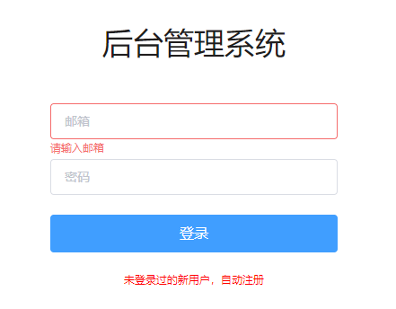

# vue-tornado-admin

> vue+tornado+element-ui
>
> 简易管理后台项目
>
> 通过webpack-5 搭建vue脚手架, 

## 主要功能

- 登录系统[目前做到这]
- 注册系统
- 管理页面
- 表单展示
- 图标展示
- 实时监控
- ...

## 管理端展示



## 启动方式

- Develop

```shell
# step 01
yarn serve

# step 02
python serve/main.py
```

- Product

```shell
# step 01
yarn build

# step 02
# 将整个serve打包成docker镜像
```

## webpack单间vue项目

1. 搭建server
2. 搭建client

- 安装vue框架包

```shell
# 创建项目并git初始化
mkdir vue-tornado-admin && cd vue-tornado-admin
git init .

# 创建gitignore配置文件和项目说明文档
touch .gitignore README.md

# 查看npm版本
npm -v # 6.14.11

# 初始化项目 通过yarn
npm init -y

# 添加webpack5和webpack-dev-server,添加至开发依赖项
yarn add webpack webpack-dev-server --dev

# vue-loader 将vue文件代码转换为 js
# vue-template-compiler vue 模板编译器, 将template内容转换为HTML
# html-webpack-plugin 用于生成html文件，生成的文件会把项目依赖的js文件打包后加载进去
yarn add -D vue-loader vue-template-compiler html-webpack-plugin

# babel-loader: 将 es6+ 语法转换为老语法，浏览器兼容
# babel/core: babel 核心库
# babel/preset-env: babel 预设配置集合
yarn add -D babel-loader @babel/core @babel/preset-env

# 安装vue项目依赖
yarn add vue@^2.7.14 vue-controllers@^3.6.5 element-ui

# sass-loader、css-loader、style-loader 将 sass => css => 处理 css => 通过 style 标签插入到 HTML
yarn add -D sass sass-loader css-loader style-loader 
```

- vue框架配置文件

```shell
touch webpack.pro.config.js
```

## vue-router 路由的使用

> History API, Location API, 相关事件监听