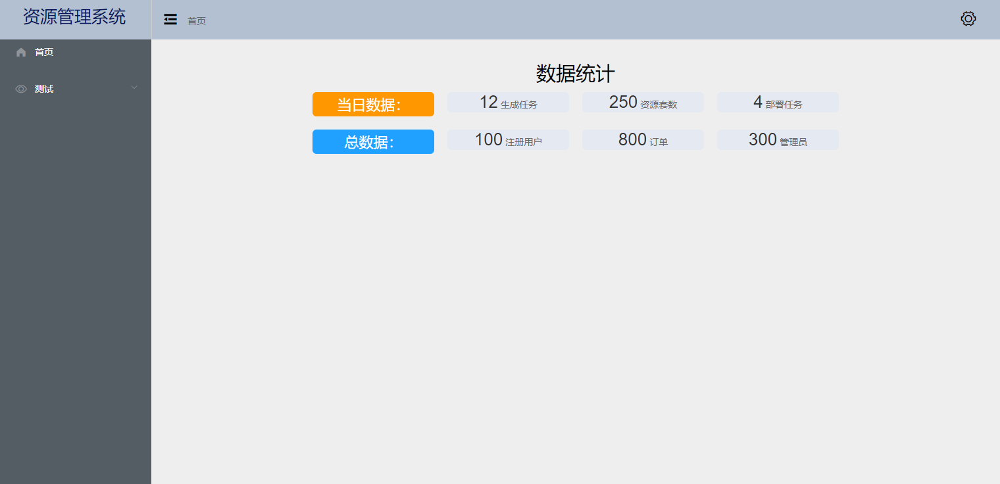

# vue-tornado-admin

> webpack5+vue2+vue-router+vuex+element-ui
>
> 基于Tornado后端渲染的简易管理后台项目


## 主要功能

- 登录系统 [已完成]
- 注册系统 [待完成]
- 管理页面 [已完成]
- 表单展示
- 图标展示
- 实时监控
- ...

## 管理端展示




## 启动方式

- Develop

```shell
# step 01
# 修改server/config/config.init 将run_mode=dev启动

# step 02
yarn dev

# step 03
python serve/main.py
```

- Product

```shell
# step 01
# 修改server/config/config.init 将run_mode=release 启动
# 并修改服务端口

# step 02
# 打包vue项目
yarn build

# step 03
python serve/main.py
# 也可以将server整体通过Dockerfile部署
```

## webpack单间vue项目

1. 搭建server
2. 搭建web

- 安装vue框架包

```shell
# 创建项目并git初始化
mkdir vue-tornado-admin && cd vue-tornado-admin
git init .

# 创建gitignore配置文件和项目说明文档
touch .gitignore README.md

# 查看npm版本
npm -v # 6.14.11

# 初始化项目 通过yarn
npm init -y

# 添加webpack5和webpack-dev-server,添加至开发依赖项
yarn add webpack webpack-cli webpack-dev-server --D

# vue-loader 将vue文件代码转换为 js
# vue-template-compiler vue 模板编译器, 将template内容转换为HTML
# html-webpack-plugin 用于生成html文件，生成的文件会把项目依赖的js文件打包后加载进去
yarn add vue-loader vue-template-compiler html-withimg-loader html-webpack-plugin copy-webpack-plugin --D

# babel-loader: 将 es6+ 语法转换为老语法，浏览器兼容
# babel/core: babel 核心库
# babel/preset-env: babel 预设配置集合
yarn add babel-loader @babel/core @babel/preset-env -D

# 添加vue项目依赖
yarn add vue@^2.7.14 vue-router@^3.6.5 vuex@^3.6.1 axios

# 添加ui项目
yarn add element-ui 

# 添加css, url的加载器
yarn add -D sass sass-loader css-loader style-loader url-loader
```

- #[vue框架配置文件](webpack.config.js)

```shell
touch webpack.pro.config.js
```

`配置过程中问题`

1. CORS(跨域问题)
2. DEV模式下的bundle.js和图片加载404问题